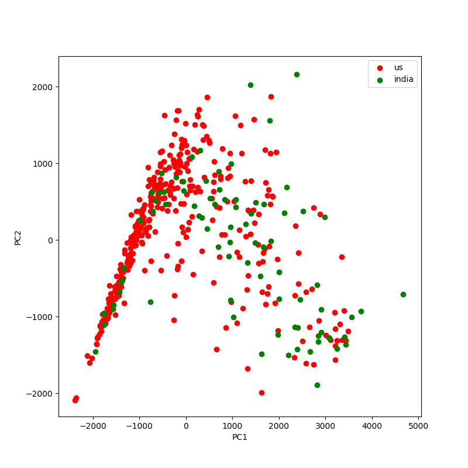
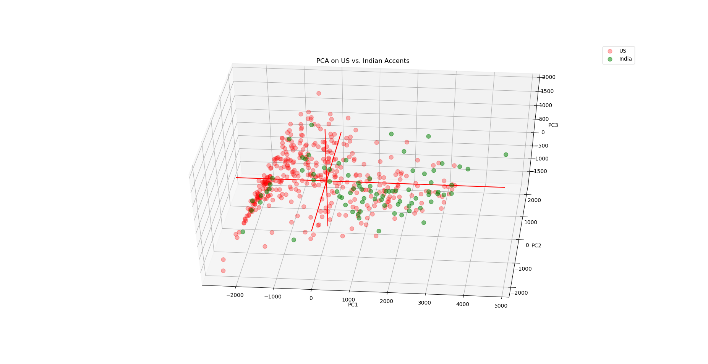
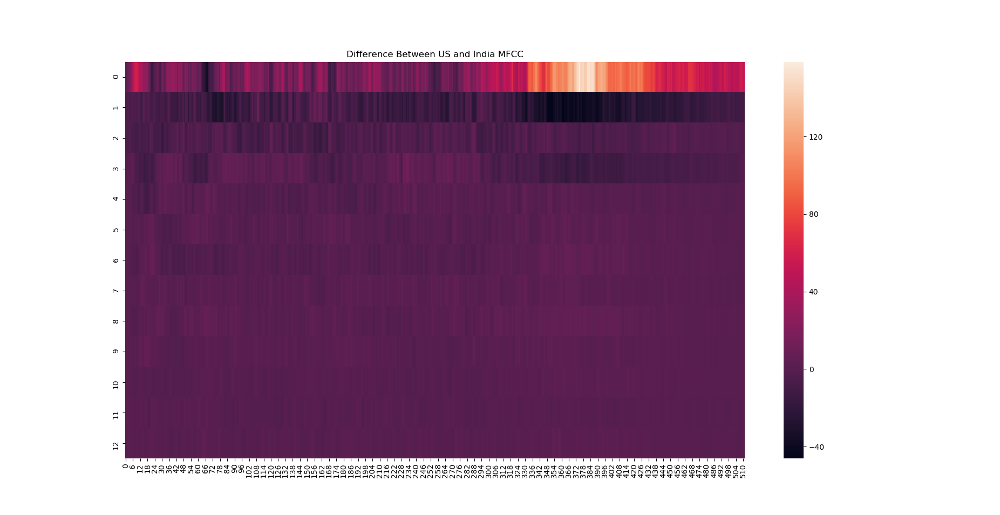

# Binary Accent Classification in Speech

- [Binary Accent Classification in Speech](#binary-accent-classification-in-speech)
    + [Overview](#overview)
    + [Dataset](#dataset)
    + [Mel Frequency Cepstrum Coefficients (MFCC)](#mel-frequency-cepstrum-coefficients--mfcc-)
  * [Motivation](#motivation)
  * [Overview](#overview-1)
    + [EDA](#eda)
    + [PCA](#pca)
      - [2D PCA](#2d-pca)
      - [3D PCA](#3d-pca)
    + [Difference in Accents](#difference-in-accents)
  * [Analysis](#analysis)
    + [CNN](#cnn)
    + [Future Work](#future-work)
  * [Current dataset](#current-dataset)
  * [Mozilla Voice Dataset](#mozilla-voice-dataset)

### Overview

Over a quarter of Americans own smart speaker systems. However, not all Americans have the same ease of use with these systems. A recent Washington Post survey found that, on average, non-native English speakers were 30% less likely to be understood by both Amazon’s Alexa and Google Home. Even amongst native speakers, people with Southern accents were 3% less likely to get accurate responses than those with Western accents.

Successful accent detection would allow voice recognition systems to expand their global reach. For accents that are hard to model, accent detection could lead to the construction of better voice recognition systems for each type of accent.

Cute Example:  

### Dataset
  The dataset is pulled from the George Mason University Speech Accent Archive. This dataset contains around 2500 audio files and speakers from over 100 countries.

  All speakers in the dataset read from the same passage:

>  "Please call Stella. Ask her to bring these things with her from the store:  Six spoons of fresh snow peas, five thick slabs of blue cheese, and maybe a snack for her brother Bob.  We also need a small plastic snake and a big toy frog for the kids.  She can scoop these things into three red bags, and we will go meet her Wednesday at the train station."

In the next capstone, I hope to work with Mozilla Voice data. The Mozilla Voice data contains tens of thousands of files of native and non-native speakers speaking different sentences. Because the audio files are so different from speaker to speaker, I am working with the smaller, more static, Speech Accent Archive first in order to get a good working model before trying to predict on the Mozilla Voice data.

## Mel Frequency Cepstrum Coefficients (MFCC)
MFCC's are meant to mimic the biological process of human's creating sound in their vocal tract and producing phonemes. Phonemes are base sounds?? that can. By identifying the difference in phonemes, we will be able to differentiate between accents.

### Motivation

### Overview
  <b>1) Bin the raw audio signal </b>  
  On short time scales, we assume that audio signals do not change very much. Therefore, we bin the raw audio signal into 20-40 ms frames. Longer frames will vary too much and shorter frames will not provide enough signal. The following steps are applied over every single one of the frames and a set of coefficients is determined for every frame.

  <b>2) Calculate the periodogram power estimates</b>  
  This process models how the cochlea interprets sounds by vibrating at different locations based on the incoming frequencies. The periodogram is an analog for this process. First, we need to take the Discrete Fourier Transform of every frame. The periodogram power estimate calculated using the following equation:

  <b>3) Apply mel filterbank and sum energies in each filter </b>  
  The cochlea can't differentiate between closely spaced frequencies. This problem is amplified at higher frequencies. So, we sum up the signal at various frequencies to get an idea of of how much energy is at that frequency.

  This filterbank is a set of 26 triangular filters. These filters are vectors that are mostly zero, except for part of the spectrum. First, we convert frequencies to the Mel Scale (converts actual tone of a frequency to its perceived frequency) We multipy each filter with the power spectrum and add up the resulting coefficients in order to obtain the filterbank energies.

  !(Screenshot of practical cryptology figure)

  <b>4) Take log of all filter energies </b>  
  We need to take the log of the previously calculated filterbank energies because humans can differentiate between low frequency sounds better than they can between high frequency sounds. We still have 26 coefficients.

  <b>5) Take Discrete Cosine Transform (DCT) of the log filterbank energies </b>  
  The standard is to create overlapping filterbanks. Therefore, these energies are correlated and we use DCT to decorrelate them. The higher DCT coefficients are then dropped, which has been shown to perform model performance, leaving us with 13 cepstral coefficients.

## EDA

First, I binned my data from the Speech Accent Archive into the same accent bins used in Mozilla voice.

| Country     | Actual Languages and Regions                                    |
|-------------|-----------------------------------------------------------------|
| US          | 'United States English'                                         |
| Australia   | 'Australian English'                                            |
| England     | 'England English'                                               |
| Canada      | 'Canadian English'                                              |
| Philippines | 'Filipino'                                                      |
| Hong Kong   | 'Hong Kong English'                                             |
| India       | 'India and South Asia (India, Pakistan, Sri Lanka)'             |
| Malaysia    | 'Malaysian English'                                             |
| New Zealand | 'New Zealand English'                                           |
| Singapore   | 'Singaporean English'                                           |
| Africa      | 'Southern African (South Africa, Zimbabwe, Namibia)'            |
| Bermuda     | 'West Indies and Bermuda (Bahamas, Bermuda, Jamaica, Trinidad)' |

### PCA
Is there signal in my data?

#### 2D PCA

There's some seperation, but not too much...
#### 3D PCA

### Difference in Accents

Show audio samples (raw signal) similar lengths (need 512 width) one from india, one from us
Subtract both and show mfcc
Show where on raw sample the differences are located and identify phoneme

## Analysis

### CNN

Why is the training accuracy so high compared to the test accuracy in the beginning? The loss also shows a similar trend, but reversed, but not as extreme as with the accuracy.

From Keras:
"A Keras model has two modes: training and testing. Regularization mechanisms, such as Dropout and L1/L2 weight regularization, are turned off at testing time.

Besides, the training loss is the average of the losses over each batch of training data. Because your model is changing over time, the loss over the first batches of an epoch is generally higher than over the last batches. On the other hand, the testing loss for an epoch is computed using the model as it is at the end of the epoch, resulting in a lower loss."

##### Confusion Matrix

|                 | Actual True | Actual False |
|-----------------|-------------|--------------|
| Predicted True  | 20          | 9            |
| Predicted False | 5           | 14           |

## Future Work

### Current dataset
I could try to optimize this model even further. People have had success using the MFCC deltas and the MFCC delta-deltas when training CNN's. I could try these later on.

Unfortunately, my data is not very interpretable, making it really hard to tell if my model is picking up on signal in my data. I would like to try using the same data with saved MFCC images. This way, I could plot neuron activation against an image and see what a CNN picks up on with MFCC's.

Try to classify more accents. I've only worked on the two most represented accents. I would ultimately like to training a CNN to classify four accents. Unfortunately, the rest of the accents in my dataset have too few samples to train on.

### Mozilla Voice Dataset

Once I have a model that works well, I would like to use that same model to test on the Mozilla Voice Data. This dataset consists of speakers of various accents speaking different sentences. I'm curious if my models would be able to classify well on data that is more random.
