# Binary Accent Classification in Speech
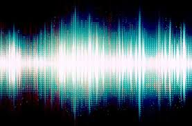

- [Binary Accent Classification in Speech](#binary-accent-classification-in-speech)
    + [Overview](#overview)
    + [Dataset](#dataset)
    + [Mel Frequency Cepstrum Coefficients (MFCC)](#mel-frequency-cepstrum-coefficients--mfcc-)
  * [Motivation](#motivation)
  * [Overview](#overview-1)
    + [EDA](#eda)
    + [PCA](#pca)
      - [2D PCA](#2d-pca)
      - [3D PCA](#3d-pca)
    + [Difference in Accents](#difference-in-accents)
  * [Analysis](#analysis)
    + [CNN](#cnn)
    + [Future Work](#future-work)
  * [Current dataset](#current-dataset)
  * [Mozilla Voice Dataset](#mozilla-voice-dataset)

### Overview

Over a quarter of Americans own smart speaker systems. However, not all Americans have the same ease of use with these systems. A recent Washington Post survey found that, on average, non-native English speakers were 30% less likely to be understood by both Amazon’s Alexa and Google Home. Even amongst native speakers, people with Southern accents were 3% less likely to get accurate responses than those with Western accents [(1)](https://www.washingtonpost.com/graphics/2018/business/alexa-does-not-understand-your-accent/?utm_term=.14216205e5d7).

Successful accent detection would allow voice recognition systems to expand their global reach. For accents that are hard to model, accent detection could lead to the construction of better voice recognition systems for each type of accent.

<b>Cute Example</b>:  

### Objectives
+ Be able to build a model that can classify the accent of the speaker using a raw audio file.
+ Understand the differences in accents that the model will identify
+ Identify shortcomings of the final model

### Dataset
  The first dataset is pulled from the George Mason University Speech Accent Archive. This dataset contains around 2500 audio files and speakers from over 100 countries.

  All speakers in the dataset read from the same passage:

>  "Please call Stella. Ask her to bring these things with her from the store:  Six spoons of fresh snow peas, five thick slabs of blue cheese, and maybe a snack for her brother Bob.  We also need a small plastic snake and a big toy frog for the kids.  She can scoop these things into three red bags, and we will go meet her Wednesday at the train station."

I decided to also work with Mozilla Voice data. The Mozilla Voice data contains tens of thousands of files of native and non-native speakers speaking different sentences. Because the audio files are so different from speaker to speaker, I am working with the smaller, more static, Speech Accent Archive first in order to get a good working model that will identify the correct signal and then use those saved weights to train the Mozilla Voice data.

## Mel Frequency Cepstrum Coefficients (MFCC)
I decided to vectorize the audio files by creating MFCC's. MFCC's are meant to mimic the biological process of humans creating sound to produce phonemes and the way humans perceive these sounds.

Phonemes are base units of sounds that combine to make up words for a language. Non-native English speakers will use different phonemes than native speakers. The phonemes non-native speakers use will also be unique to their native language(s). By identifying the difference in phonemes, we will be able to differentiate between accents.

### Motivation

### Overview
  <b>1) Bin the raw audio signal </b>  
  Since the motivation is to produce a matrix from a continuous signal, we will have to start by binning the audio signal. On short time scales, we assume that audio signals do not change very much. Longer frames will vary too much and shorter frames will not provide enough signal. The standard is to bin the raw audio signal into 20-40 ms frames.
  
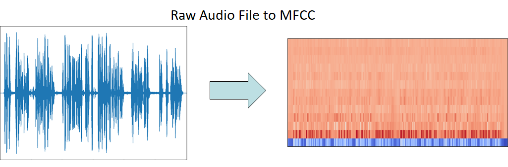

  The following steps are applied over every single one of the frames and a set of coefficients is determined for every frame:

  <b>2) Calculate the periodogram power estimates</b>  
  This process models how the cochlea interprets sounds by vibrating at different locations based on the incoming frequencies. The periodogram is an analog for this process as it measures spectral density at different frequencies. First, we need to take the Discrete Fourier Transform of every frame. The periodogram power estimate is calculated using the following equation:   

  
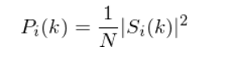

  
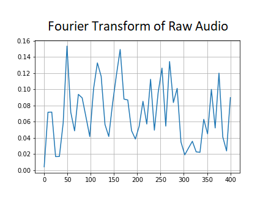

  
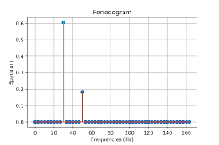

  <b>3) Apply mel filterbank and sum energies in each filter </b>  
  The cochlea can't differentiate between frequencies that are very close to each other. This problem is amplified at higher frequencies, meaning that greater ranges of frequencies will be increasingly interpreted as the same pitch. So, we sum up the signal at various increasing ranges of frequencies to get a measure of the energy density in each range.

  This filterbank is a set of 26 triangular filters. These filters are vectors that are mostly zero, except for a small range of the spectrum. First, we convert frequencies to the Mel Scale (converts actual tone of a frequency to its perceived frequency). Then we multiply each filter with the power spectrum and add up the resulting coefficients in order to obtain the filterbank energies. In the end, we will have a single coefficient for each filter.

  Mel Scale Conversion:  
  
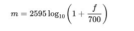

  Filterbanks [(2)](http://www.practicalcryptography.com/miscellaneous/machine-learning/guide-mel-frequency-cepstral-coefficients-mfccs/):  
  
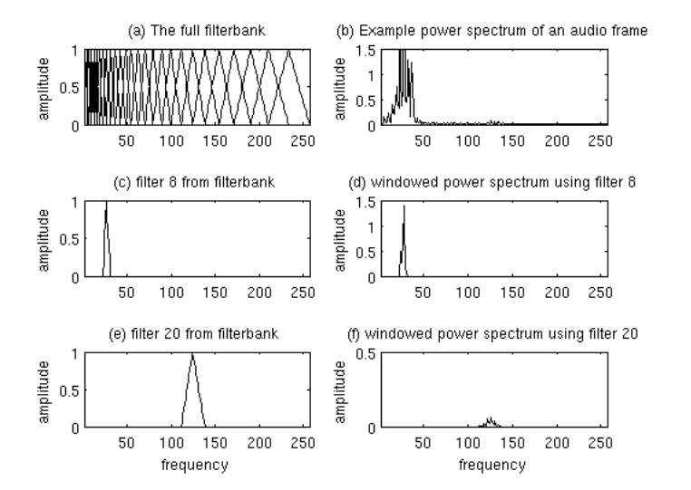

  <b>4) Take log of all filter energies </b>  
  We need to take the log of the previously calculated filterbank energies because humans can differentiate between low frequency sounds better than they can between high frequency sounds. The shape of the matrix hasn't changed, so we still have 26 coefficients.

  <b>5) Take Discrete Cosine Transform (DCT) of the log filterbank energies </b>  
  Because the standard is to create overlapping filterbanks, these energies are correlated and we use DCT to decorrelate them. The higher DCT coefficients are then dropped, which has been shown to perform model performance, leaving us with 13 cepstral coefficients.

  
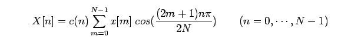

Resources for learning about MFCC's:   
1) [Pratheeksha Nair's Medium Aricle](https://medium.com/prathena/the-dummys-guide-to-mfcc-aceab2450fd)  
2) [Haytham Fayek's Personal Website](https://haythamfayek.com/2016/04/21/speech-processing-for-machine-learning.html)  
3) [Practical Cryptography](http://www.practicalcryptography.com/miscellaneous/machine-learning/guide-mel-frequency-cepstral-coefficients-mfccs/)

## EDA

First, I binned my data from the Speech Accent Archive into the same accent bins used in Mozilla voice.

| Country     | Actual Languages and Regions                                    |
|-------------|-----------------------------------------------------------------|
| US          | 'United States English'                                         |
| Australia   | 'Australian English'                                            |
| England     | 'England English'                                               |
| Canada      | 'Canadian English'                                              |
| Philippines | 'Filipino'                                                      |
| Hong Kong   | 'Hong Kong English'                                             |
| India       | 'India and South Asia (India, Pakistan, Sri Lanka)'             |
| Malaysia    | 'Malaysian English'                                             |
| New Zealand | 'New Zealand English'                                           |
| Singapore   | 'Singaporean English'                                           |
| Africa      | 'Southern African (South Africa, Zimbabwe, Namibia)'            |
| Bermuda     | 'West Indies and Bermuda (Bahamas, Bermuda, Jamaica, Trinidad)' |

For my first analysis, I decided to stick to a binary classification. I choose the two groupings of native countries with the most samples: USA and India (South Asia).

Once I was able to prove that my pipeline was working, I moved onto classifying the three accents with the most samples in the Speech Accent Archive Dataset: USA, India (South Asia), and the UK.

To create the MFCCs, I binned into 31 ms increments (chosen because it gives 64 bins, which makes setting up a CNN easier), 13 MFCCs, and the default settings for everything else.

The classes are imbalanced in both datasets, with US accents being the most represented. In the case of the Speech Accent Archive Data, I decided to oversample the minority classes so that they would have a similar size. For the Mozilla Data, I decided to undersample. The least represented accent in this dataset is Indian, with ~16,000 samples. That is plenty of data to train a CNN, so I decided undersampling US and UK accents would be easiest.

### PCA
Before I got started on creating any models, I wanted to make sure that there were differences in my accent groupings, so I performed PCA on the Speech Accent Archive Data.

#### 2D PCA

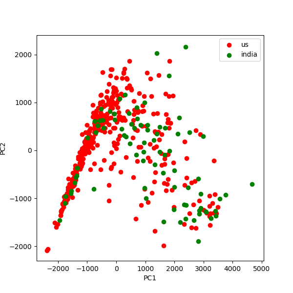

There's some separation, but not too much...

#### 3D PCA

Here we can start to see some separation. The clusters are not clearly defined, but that is to be expected as there's probably overlap between between these accents because people native to India could also be settled in the US and vice versa. Listening to some of the Indian audio files shows that some of the accents labeled Indian have American English sounding speech patterns.

##### Three Class PCA

There is also good separation in this graph, so I feel confident I can get decent results classifying three accents as well.

### Difference in Accents
I wanted to see if I could see what type of signal my CNN would pick up on. I decided to calculate the mean MFCC's and take the difference of each unique group of two accents to see where two accents differ from each other.

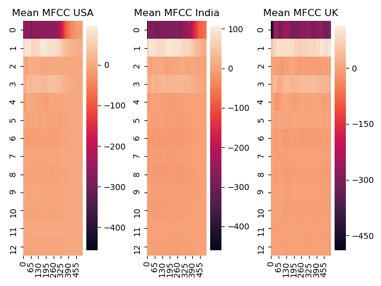

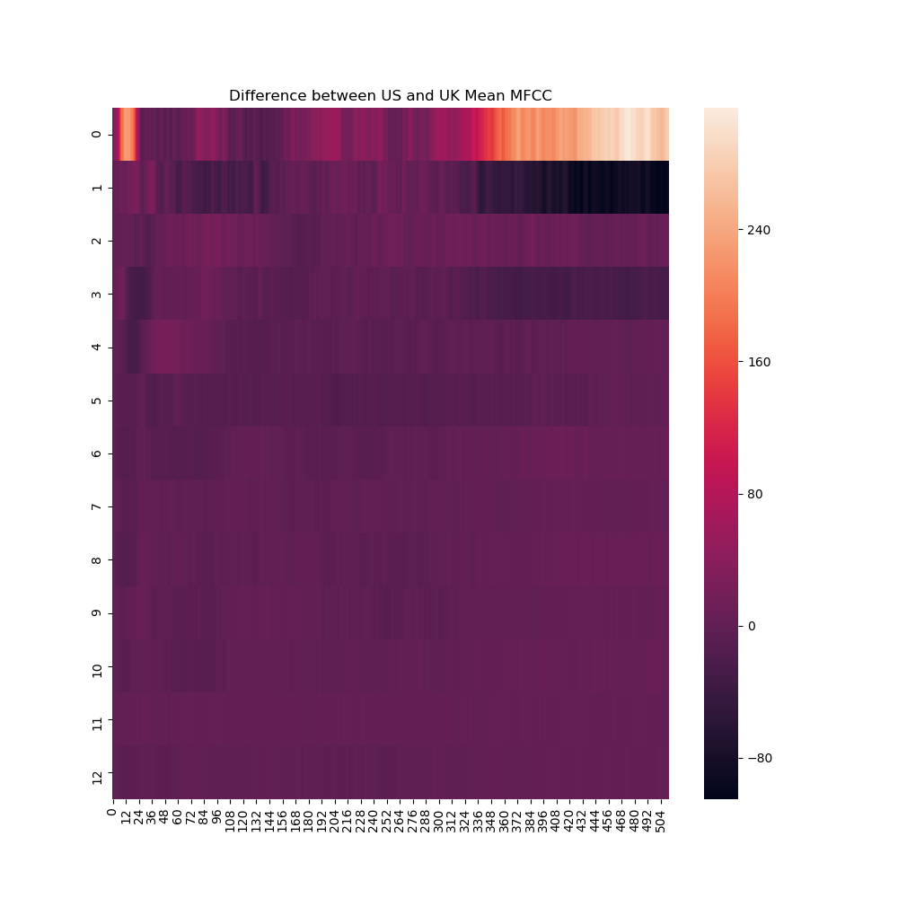

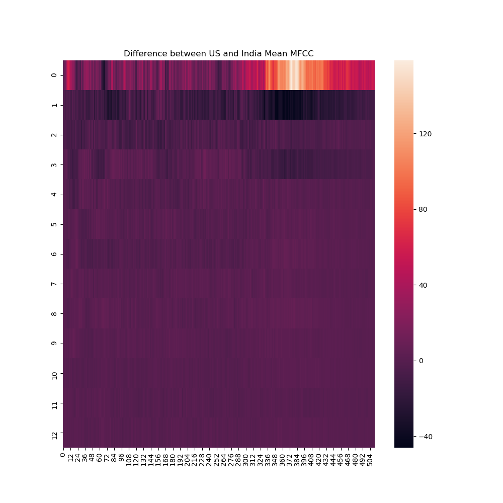

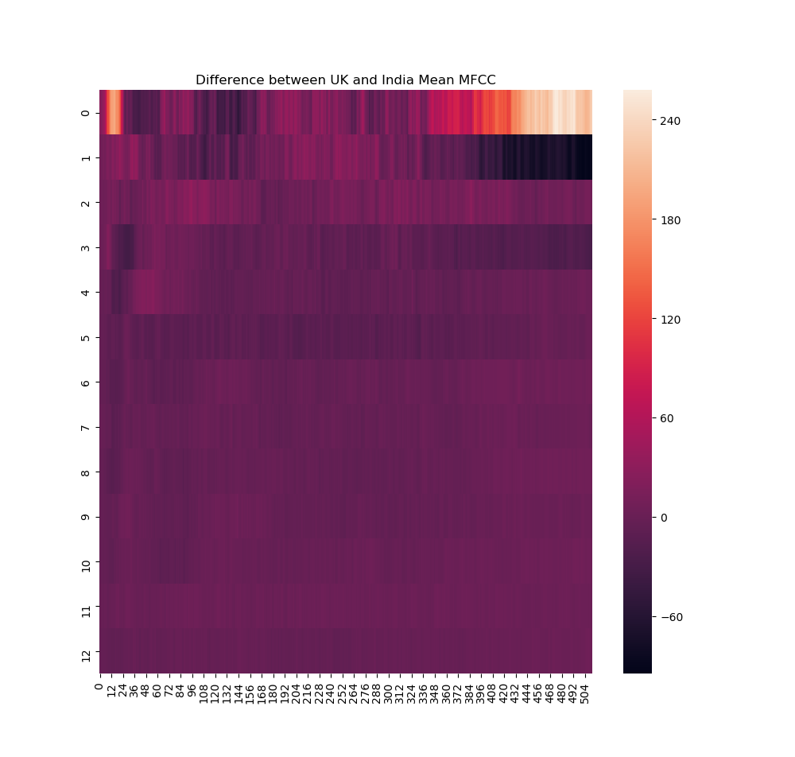

Picked two raw audio files from US and Indian accents that were similar in length to the mean spectrograms above. I picked two points that seemed to have the highest values in the subtracted mean spectrogram. I then listened to the audio files and found that the times corresponded to the following words: "Stella" at 2 seconds and "We need a small plastic snake" around 11 seconds.

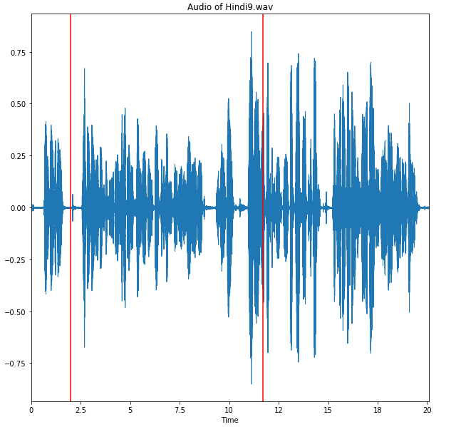

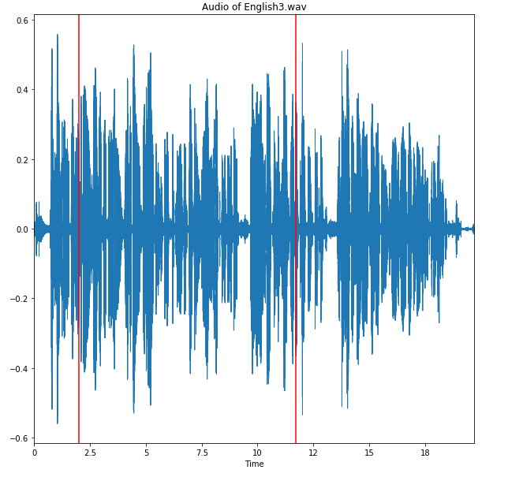

## Analysis

### CNN
My model:  

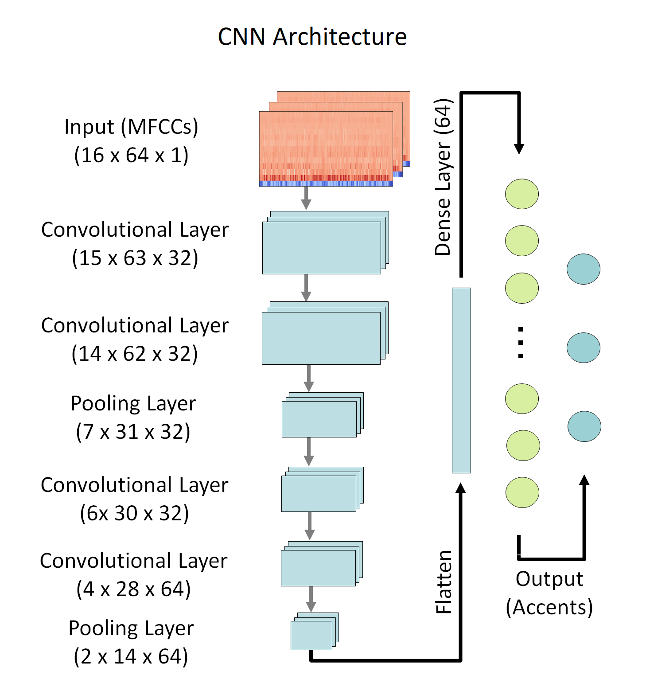

Because the Mozilla Dataset has a lot of variability in terms of what the speaker is reciting, I decided to use the Speech Accent Archive Data first and save the weights from my model with the highest accuracy to train the Mozilla Dataset. This method worked very well and saved a lot of training time because my Mozilla Data would start off at ~65% validation accuracy at the first epoch.

Due to the file size of the Mozilla Voice Data, I had to store and train my data using AWS (p2xl instance using an attached EBS volume).

#### Two Accent Classification Results

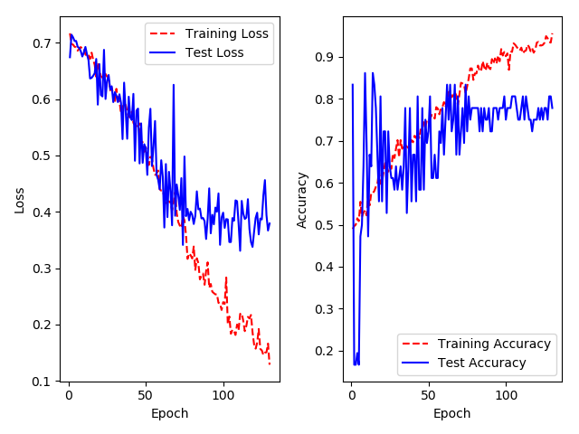

<b>Test Accuracy on Holdout Data: 78% </b>
##### Mozilla Voice Data

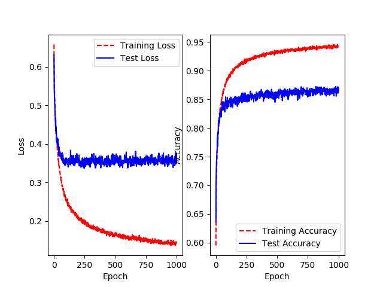

<b>Test Accuracy on Holdout Data: 87% </b>

Why is the test accuracy so high compared to the training accuracy in the beginning? The loss also shows a similar trend, but reversed, but not as extreme as with the accuracy.

From [Keras FAQ](https://keras.io/getting-started/faq/):
"A Keras model has two modes: training and testing. Regularization mechanisms, such as Dropout and L1/L2 weight regularization, are turned off at testing time.

Besides, the training loss is the average of the losses over each batch of training data. Because your model is changing over time, the loss over the first batches of an epoch is generally higher than over the last batches. On the other hand, the testing loss for an epoch is computed using the model as it is at the end of the epoch, resulting in a lower loss."

#### Three Accents Classification Results
##### Speech Accent Archive Data

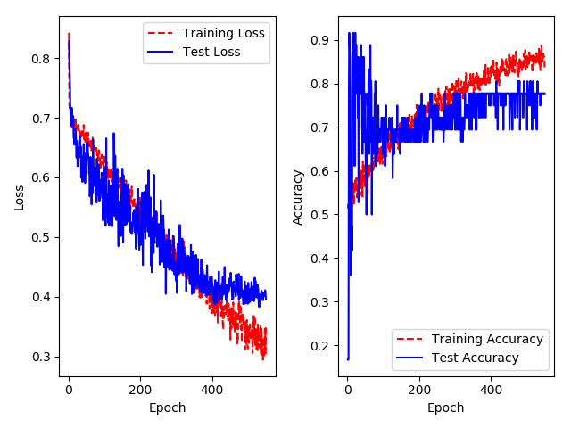

<b>Test Accuracy on Holdout Data: 73% </b>
##### Mozilla Voice Data

<b>Test Accuracy on Holdout Data: 90% </b>

My three accent model did worse on the Speech Accent Archive Data but better on the Mozilla Data. It makes sense that a model trained on a small dataset with class imbalance would have worse performance for more classes. However, when training the Mozilla Dataset, the model does better because there is an extra 16,000 data points. CNN's are data hungry so the increase in performance with more data seems reasonable.

The sudden dips in accuracy are a little worrisome so I decided to try a smaller learning rate to see if it's a problem with my gradient descent. The smaller learning rate (0.0001) really improved the number of dips. With more time, I would try an even smaller learning rate to see if I can entirely eliminate the dips.

#### Was Transfer Learning Necessary?

Transfer Learning was not needed. However, the power of transfer learning can be seen in the graph below, which shows the first 150 epochs of a model that uses the same architecture as my three class model but doesn't use saved weights. The model needs to train longer to get to a good accuracy. When dealing with as much data as we are, the more we can save computation time, the better. Especially considering that the smaller model took less than five minutes to train locally, the transfer learning model seems superior.

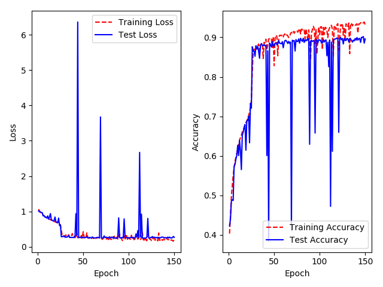

## Incorrect Classifications
Going back and listening to the files where my model failed brought two conclusions:
 + The majority of the misclassified test data was incorrectly labeled
 + Most of the remaining misclassified data was problematic because the accent seemed to be a blend, indicating that the speaker may also be fluent in another language.

While it would be best if the model could also correctly classify these blended accents, the blended accents may not pose a serious problem because speech recognition systems may not have a problem picking up what these speakers are saying. For example, a speech recognition system trained mainly on US data may be able to pick up fairly well on a speaker who from the UK who has spent a fair amount of time in the US. As long as the model is classifying speakers with more traditional UK accents, we can build another speech recognition model for these speakers.

## Future Work

### Current dataset
I could try to optimize this model even further. People have had success using the MFCC deltas and the MFCC delta-deltas when training CNN's. I could try these later on.

Unfortunately, my data is not very interpretable, making it really hard to tell if my model is picking up on signal in my data. I would like to try using the same data with saved MFCC images. This way, I could plot neuron activation against an image and see what a CNN picks up on with MFCC's.

Additionally, CNN's may not need us to process data into MFCC's, which is a step that is very important for success with HMM and GMM models. However, a CNN should be able to pick up on signal without all the processing, so it would be interesting to see if a spectrogram would perform as well as an MFCC.

Try to classify more accents. I've only worked on the three most represented accents. I would ultimately like to train a CNN to classify most of the accents in the Mozilla Voice data (except for the accents that have very few samples).
